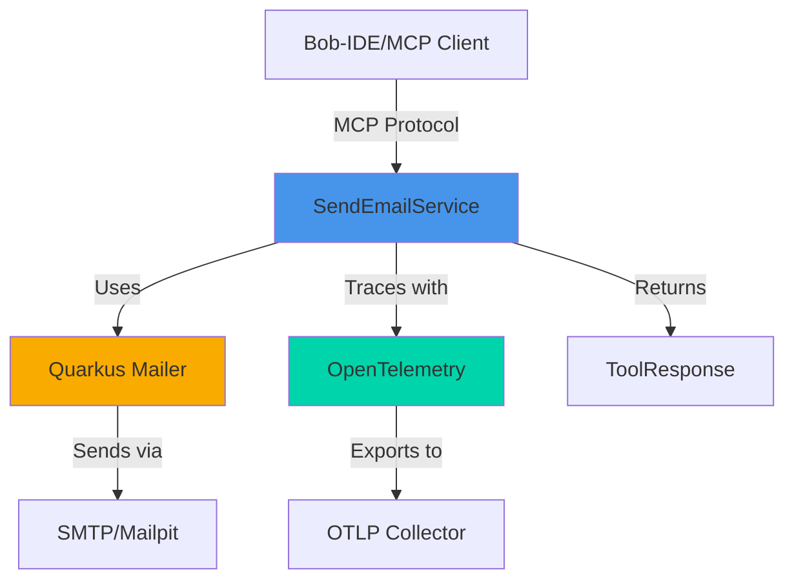

# Quarkus Tools for Bob-IDE: SendEmailService Implementation Guide

## Overview

This guide explains how to create a `SendEmailService` class using Quarkus tools for bob-ide. The service demonstrates integration of multiple Quarkus extensions including Mailer, OpenTelemetry, LangChain4j, and MCP Server.

## Architecture



## Required Quarkus Dependencies

### Maven Dependencies (pom.xml)

```xml
<properties>
    <quarkus.platform.version>3.29.0</quarkus.platform.version>
    <quarkus.mailpit.version>1.7.0</quarkus.mailpit.version>
</properties>

<dependencyManagement>
    <dependencies>
        <!-- Quarkus BOM -->
        <dependency>
            <groupId>io.quarkus.platform</groupId>
            <artifactId>quarkus-bom</artifactId>
            <version>${quarkus.platform.version}</version>
            <type>pom</type>
            <scope>import</scope>
        </dependency>
        
        <!-- MCP Server BOM -->
        <dependency>
            <groupId>io.quarkus.platform</groupId>
            <artifactId>quarkus-mcp-server-bom</artifactId>
            <version>${quarkus.platform.version}</version>
            <type>pom</type>
            <scope>import</scope>
        </dependency>
        
        <!-- LangChain4j BOM -->
        <dependency>
            <groupId>io.quarkus.platform</groupId>
            <artifactId>quarkus-langchain4j-bom</artifactId>
            <version>${quarkus.platform.version}</version>
            <type>pom</type>
            <scope>import</scope>
        </dependency>
    </dependencies>
</dependencyManagement>

<dependencies>
    <!-- MCP Server SSE Transport -->
    <dependency>
        <groupId>io.quarkiverse.mcp</groupId>
        <artifactId>quarkus-mcp-server-sse</artifactId>
    </dependency>
    
    <!-- LangChain4j for AI tool annotations -->
    <dependency>
        <groupId>io.quarkiverse.langchain4j</groupId>
        <artifactId>quarkus-langchain4j-openai</artifactId>
    </dependency>
    
    <!-- Quarkus Mailer -->
    <dependency>
        <groupId>io.quarkus</groupId>
        <artifactId>quarkus-mailer</artifactId>
    </dependency>
    
    <!-- Mailpit for development/testing -->
    <dependency>
        <groupId>io.quarkiverse.mailpit</groupId>
        <artifactId>quarkus-mailpit</artifactId>
        <version>${quarkus.mailpit.version}</version>
    </dependency>
    
    <!-- OpenTelemetry for tracing -->
    <dependency>
        <groupId>io.quarkus</groupId>
        <artifactId>quarkus-opentelemetry</artifactId>
    </dependency>
    
    <!-- Micrometer with OpenTelemetry -->
    <dependency>
        <groupId>io.quarkus</groupId>
        <artifactId>quarkus-micrometer-opentelemetry</artifactId>
    </dependency>
    
    <!-- CDI/Arc for dependency injection -->
    <dependency>
        <groupId>io.quarkus</groupId>
        <artifactId>quarkus-arc</artifactId>
    </dependency>
</dependencies>
```

### Key Quarkus Extensions Explained

1. **quarkus-mcp-server-sse**: Provides MCP (Model Context Protocol) server capabilities with SSE transport
2. **quarkus-langchain4j-openai**: Enables LangChain4j integration for AI tool definitions
3. **quarkus-mailer**: Email sending capabilities with reactive and blocking APIs
4. **quarkus-mailpit**: Development mail server for testing (catches emails locally)
5. **quarkus-opentelemetry**: Distributed tracing and observability
6. **quarkus-arc**: CDI container for dependency injection

## Configuration (application.properties)

```properties
# Application name
quarkus.application.name=parasol-tools

# MCP Server configuration
quarkus.mcp.server.traffic-logging.enabled=true
quarkus.mcp.server.auto-ping-interval=5S
quarkus.mcp.server.server-info.name=parasol-tools
quarkus.mcp.server.server-info.title=Parasol Tools

# HTTP/CORS configuration
quarkus.http.cors.enabled=true
quarkus.http.cors.origins=*
quarkus.http.port=8088

# Mailer configuration
quarkus.mailer.tls=false
%dev.quarkus.mailer.mock=false

# OpenTelemetry configuration
quarkus.otel.logs.enabled=true
quarkus.otel.metrics.enabled=true

# LangChain4j configuration (if using AI features)
quarkus.langchain4j.log-requests=true
quarkus.langchain4j.log-responses=true
```

## SendEmailService Implementation

### Complete Implementation

```java
package org.parasol.tools;

import jakarta.enterprise.context.ApplicationScoped;

import io.quarkus.mailer.Mail;
import io.quarkus.mailer.Mailer;

import io.opentelemetry.api.trace.Span;
import io.opentelemetry.api.trace.SpanKind;
import io.opentelemetry.api.trace.Tracer;
import io.opentelemetry.context.Context;
import io.quarkiverse.mcp.server.ToolResponse;

import dev.langchain4j.agent.tool.P;

@ApplicationScoped
public class SendEmailService {
  
  // Email record with LangChain4j parameter descriptions
  public record Email(
      @P("The to address") String to,
      @P("The from address") String from,
      @P("The email subject") String subject,
      @P("The email body") String body) {}

  private final Mailer mailer;
  private final Tracer tracer;

  // Constructor injection of dependencies
  public SendEmailService(Mailer mailer, Tracer tracer) {
    this.mailer = mailer;
    this.tracer = tracer;
  }

  // Uncomment to expose as LangChain4j tool
  // @dev.langchain4j.agent.tool.Tool(name = "sendEmail", value = "Sends an email")
  public ToolResponse sendEmail(Email email) {
    // Create OpenTelemetry span for tracing
    var span = this.tracer.spanBuilder("sendEmail")
        .setAttribute("arg.email", email.toString())
        .setParent(Context.current().with(Span.current()))
        .setSpanKind(SpanKind.SERVER)
        .startSpan();

    try {
      // Create and send email using Quarkus Mailer
      var mail = Mail.withText(email.to(), email.subject(), email.body())
          .setFrom(email.from());

      this.mailer.send(mail);

      return ToolResponse.success("Email successfully sent");
    }
    finally {
      // Always end span in finally block
      span.end();
    }
  }
}
```

## Component Breakdown

### 1. Email Record with LangChain4j Annotations

```java
public record Email(
    @P("The to address") String to,
    @P("The from address") String from,
    @P("The email subject") String subject,
    @P("The email body") String body) {}
```

**Purpose**: Defines the email data structure as a Java record

**Key Features**:
- `@P` annotation from LangChain4j provides parameter descriptions for AI tools
- Immutable record type ensures thread safety
- Compact syntax reduces boilerplate
- Automatic `toString()`, `equals()`, and `hashCode()` implementations

**Usage in Bob-IDE**: When exposed as an MCP tool, these descriptions help the AI understand parameter purposes

### 2. Dependency Injection

```java
private final Mailer mailer;
private final Tracer tracer;

public SendEmailService(Mailer mailer, Tracer tracer) {
  this.mailer = mailer;
  this.tracer = tracer;
}
```

**Purpose**: Inject Quarkus-managed dependencies

**Key Features**:
- `@ApplicationScoped` makes this a CDI bean
- Constructor injection (recommended over field injection)
- `Mailer`: Quarkus email sending service
- `Tracer`: OpenTelemetry tracer for distributed tracing

### 3. Quarkus Mailer API Usage

```java
var mail = Mail.withText(email.to(), email.subject(), email.body())
    .setFrom(email.from());

this.mailer.send(mail);
```

**Purpose**: Send emails using Quarkus Mailer

**Key Features**:
- `Mail.withText()`: Creates a text-based email (also supports HTML with `Mail.withHtml()`)
- Fluent API for building email messages
- `setFrom()`: Sets sender address
- `send()`: Blocking send operation (use `sendAsync()` for reactive)

**Additional Mailer Capabilities**:
```java
// HTML email
Mail.withHtml(to, subject, htmlBody)

// With attachments
mail.addAttachment("file.pdf", data, "application/pdf")

// With CC/BCC
mail.setCc(List.of("cc@example.com"))
mail.setBcc(List.of("bcc@example.com"))

// Async sending
mailer.send(mail).await().indefinitely()
```

### 4. OpenTelemetry Tracing Integration

```java
var span = this.tracer.spanBuilder("sendEmail")
    .setAttribute("arg.email", email.toString())
    .setParent(Context.current().with(Span.current()))
    .setSpanKind(SpanKind.SERVER)
    .startSpan();

try {
  // ... email sending logic
  return ToolResponse.success("Email successfully sent");
}
finally {
  span.end();
}
```

**Purpose**: Add distributed tracing for observability

**Key Features**:
- **Span Creation**: `spanBuilder("sendEmail")` creates a named span
- **Attributes**: `setAttribute()` adds metadata to the span
- **Parent Context**: Links span to current trace context
- **Span Kind**: `SpanKind.SERVER` indicates this is a server-side operation
- **Lifecycle Management**: `try-finally` ensures span is always closed

**Span Lifecycle Best Practices**:
1. Always create span before operation
2. Add relevant attributes for debugging
3. Use `try-finally` to guarantee span closure
4. End span even if operation fails

**Tracing Benefits**:
- Track email sending performance
- Debug failures with full context
- Correlate with other service calls
- Monitor system health

### 5. MCP Server Integration

```java
return ToolResponse.success("Email successfully sent");
```

**Purpose**: Return standardized response for MCP protocol

**Key Features**:
- `ToolResponse.success()`: Indicates successful operation
- `ToolResponse.error()`: For error cases
- Integrates with MCP server protocol
- Provides structured responses to bob-ide

**ToolResponse Types**:
```java
// Success with message
ToolResponse.success("Operation completed")

// Success with structured data
ToolResponse.success(Map.of("status", "sent", "messageId", id))

// Error response
ToolResponse.error("Failed to send email: " + e.getMessage())
```

## Usage Patterns

### As MCP Tool (Uncomment @Tool annotation)

```java
@dev.langchain4j.agent.tool.Tool(
    name = "sendEmail", 
    value = "Sends an email"
)
public ToolResponse sendEmail(Email email) {
  // ... implementation
}
```

When exposed as a tool, bob-ide can call this service through the MCP protocol.

### Direct Service Usage

```java
@Inject
SendEmailService emailService;

public void notifyUser() {
  var email = new SendEmailService.Email(
    "user@example.com",
    "noreply@parasol.com",
    "Claim Update",
    "Your claim has been processed."
  );
  
  emailService.sendEmail(email);
}
```

## Testing with Mailpit

Mailpit captures emails during development:

1. Start Quarkus in dev mode: `./mvnw quarkus:dev`
2. Mailpit UI available at: `http://localhost:8025`
3. View sent emails without actual SMTP server
4. Test email formatting and content

## Observability

### View Traces

With OpenTelemetry configured, traces are exported to OTLP collector:

```properties
quarkus.otel.exporter.otlp.endpoint=http://localhost:4317
```

### Metrics

Email sending metrics automatically collected:
- Send duration
- Success/failure rates
- Email volume

## Best Practices

1. **Error Handling**: Add try-catch for email failures
2. **Validation**: Validate email addresses before sending
3. **Async Operations**: Use `sendAsync()` for non-blocking operations
4. **Rate Limiting**: Implement rate limiting for production
5. **Templates**: Use Qute templates for HTML emails
6. **Configuration**: Externalize SMTP settings
7. **Testing**: Use Mailpit in dev/test environments
8. **Monitoring**: Always include tracing for production debugging

## Advanced Features

### HTML Email with Qute Templates

```java
@Inject
Template emailTemplate;

public void sendHtmlEmail() {
  String html = emailTemplate
    .data("name", "John")
    .data("claimId", "12345")
    .render();
    
  Mail.withHtml(to, subject, html)
    .setFrom(from)
    .send();
}
```

### Reactive Email Sending

```java
public Uni<Void> sendEmailAsync(Email email) {
  return mailer.send(
    Mail.withText(email.to(), email.subject(), email.body())
      .setFrom(email.from())
  );
}
```

### Custom Span Attributes

```java
span.setAttribute("email.to", email.to());
span.setAttribute("email.subject", email.subject());
span.setAttribute("email.size", email.body().length());
```

## Integration with Bob-IDE

When this service is deployed as an MCP server:

1. Bob-IDE connects via SSE transport on port 8088
2. Service appears as available tool in bob-ide
3. AI can invoke `sendEmail` with proper parameters
4. Responses flow back through MCP protocol
5. Traces visible in observability platform

## Summary

The `SendEmailService` demonstrates key Quarkus tools for bob-ide:

- **Quarkus Mailer**: Simple, powerful email API
- **OpenTelemetry**: Built-in distributed tracing
- **LangChain4j**: AI tool integration
- **MCP Server**: Protocol for AI tool exposure
- **CDI/Arc**: Dependency injection
- **Mailpit**: Development email testing

This architecture provides a production-ready, observable, and AI-integrated email service.